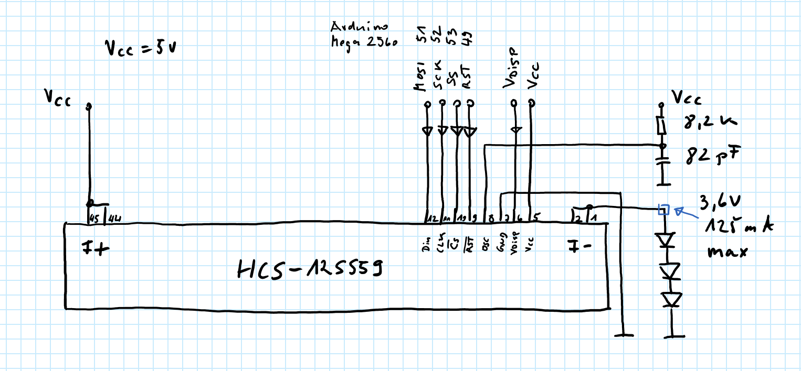
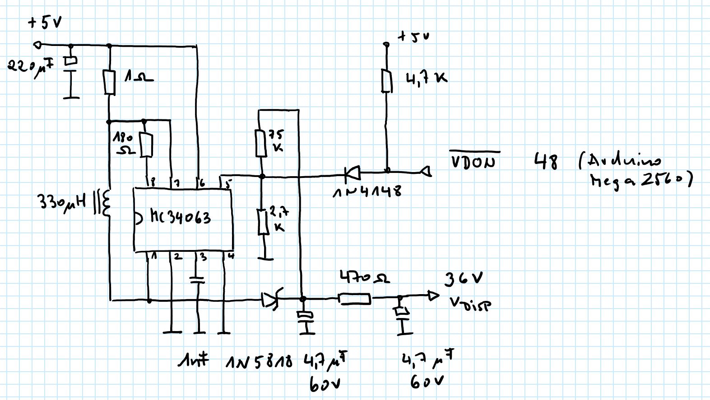

# Arduino Driver for Samsung HCS-12SS59T VFDisplay
quick and simple driver and example

## 

## Code
-> source directory

## Schematics
### Display

- mix normal and schottky diodes on VF- for desired voltage
- keeping F voltage low extends tungsten filament lifetime  
  voltages starting with 2.7 V up to 3.6 V are working  
  do not exceed 125 mA!

### Grid and Anode Voltage

- the simple _VDON with 1N4148 does not switch off Vdisp entirely,  
  maybe it can be omitted because the 470 ohm resistor on Vdisp  
  restricts current for VFD grid and anode

## History
__V0.5__  
initial version

## Links
http://www.lapis-semi.com/en/data/datasheet-file_db/display/FEDL9289-01.pdf  
https://www.pollin.de/productdownloads/D121466D.PDF  
https://www.noritake-elec.com/technology/general-technical-information/vfd-operation  
http://www.kerrywong.com/2013/06/05/vfd-filament-driver-using-555/  
https://threeneurons.wordpress.com/vfd-stuff/  
